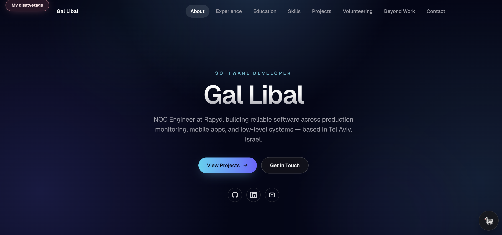
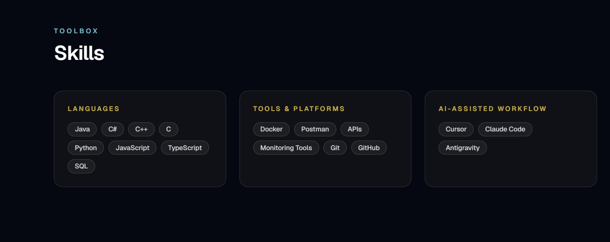
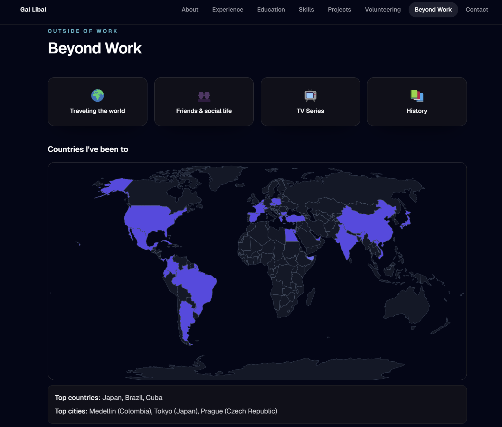

# Personal Portfolio Website

My personal portfolio — a single-page site presenting who I am, my work experience, education, skills, and projects, built to showcase my background and technical abilities in a clean, modern way.

## Features

- Hero, About, Experience, Education, Skills, Projects, Volunteering, and Contact sections
- Interactive world map of countries I've visited, plus a hobbies section
- Sticky navigation with scroll-spy and a mobile menu
- Fully responsive, with smooth scroll-triggered animations

  
  

## Technologies Used

- Next.js (App Router, static export)
- React & TypeScript
- Tailwind CSS
- Framer Motion
- D3.js / TopoJSON (world map)
